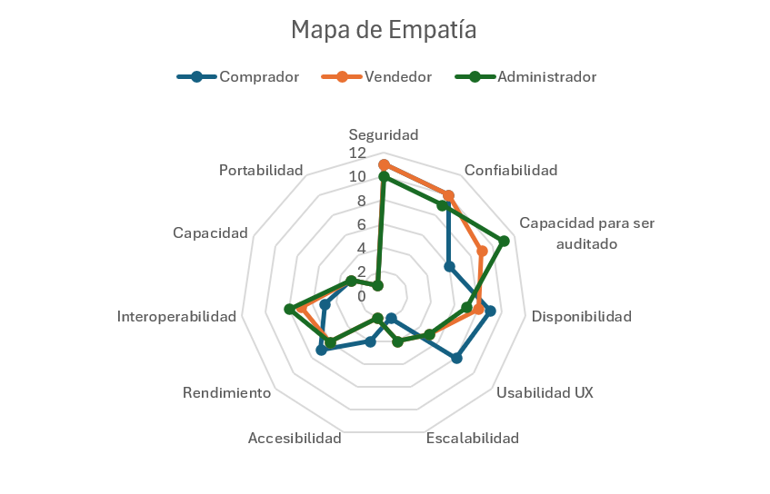

# Tradeoff

## Contenido

1. [Matriz de tradeoff](#1-matriz-de-tradeoff)
2. [Priorización por dot voting](#2-priorización-por-dot-voting)
3. [Mapa de empatía](#3-mapa-de-empatía)
4. [Lluvia de escenarios](#4-lluvia-de-escenarios)
5. [Escenarios de calidad escogidos](#5-escenarios-de-calidad-escogidos)
6. [Especificación de los escenarios de calidad](#6-especificación-de-los-escenarios-de-calidad)

## 1. Matriz de tradeoff

Prioridad asignada a cada atributo de calidad, de **11** (más prioritario) a **1** (menos prioritario).

| Atributo de calidad | Prioridad |
|:---|---:|
| Seguridad | 11 |
| Confiabilidad | 10 |
| Capacidad de ser auditado | 9 |
| Disponibilidad | 8 |
| Interoperabilidad | 7 |
| Rendimiento | 6 |
| Usabilidad UX | 5 |
| Escalabilidad | 4 |
| Capacidad | 3 |
| Accesibilidad | 2 |
| Portabilidad | 1 |

## 2. Priorización por dot voting

| Atributo de calidad | Comprador | Vendedor | Administrador | Total de votos | Ponderador global |
|:---|---:|---:|---:|---:|---:|
| Seguridad | 11 | 11 | 10 | 32 | 0.1616 |
| Confiabilidad | 10 | 10 | 9 | 29 | 0.1465 |
| Capacidad de ser auditado | 6 | 9 | 11 | 26 | 0.1313 |
| Disponibilidad | 9 | 8 | 7 | 24 | 0.1212 |
| Usabilidad UX | 8 | 5 | 5 | 18 | 0.0909 |
| Escalabilidad | 2 | 4 | 4 | 10 | 0.0505 |
| Accesibilidad | 4 | 2 | 2 | 8 | 0.0404 |
| Rendimiento | 7 | 6 | 6 | 19 | 0.0960 |
| Interoperabilidad | 5 | 7 | 8 | 20 | 0.1010 |
| Capacidad | 3 | 3 | 3 | 9 | 0.0455 |
| Portabilidad | 1 | 1 | 1 | 3 | 0.0152 |
| **Total** | 66 | 66 | 66 | 198 | 1.0000 |

## 3. Mapa de empatía

Gráfico con los votos de cada actor sobre los once atributos de calidad.

---

## 4. Lluvia de escenarios

>**Criterio de dot voting:** Se asignó un 25% del total de ideas a cada actor, lo que da 24.75 ideas, quedando finalmente 25 puntos a cada actor. Cada actor puede dar un máximo de 2 puntos a una idea que le parezca más importante, siendo 2 puntos un punto de importancia máxima

### Seguridad

**CAR-SEG-0001**
El sistema debe gestionar de forma segura las credenciales y el ciclo de vida de las sesiones de sus usuarios

| Código escenario | Descripción del escenario | Comprador | Vendedor | Administrador | Total |
|:---|:---|---:|---:|---:|---:|
| ESC-CAL-SEG-0001 | Quiero que, al olvidar la contraseña, pueda reestablecerla | 0 | 0 | 0 | 0 |
| ESC-CAL-SEG-0002 | Si un usuario deja su sesión abierta durante un periodo prolongado de inactividad, el sistema debe evitar que otra persona pueda continuar utilizando indefinidamente esa sesión | 1 | 1 | 1 | 3 |
| ESC-CAL-SEG-0003 | Cuando un usuario cambie su contraseña, las sesiones que representen un riesgo deben poder invalidarse para evitar accesos con credenciales anteriores | 0 | 0 | 0 | 0 |

**CAR-SEG-0002**
El sistema debe garantizar que cada usuario solo acceda y opere sobre los recursos y operaciones que le corresponden

| Código escenario | Descripción del escenario | Comprador | Vendedor | Administrador | Total |
|:---|:---|---:|---:|---:|---:|
| ESC-CAL-SEG-0004 | El sistema debe impedir que usuarios no autorizados accedan o modifiquen información y recursos que no les pertenecen | 1 | 1 | 2 | 4 |
| ESC-CAL-SEG-0005 | Un usuario no puede aceptar, cancelar o confirmar operaciones en las que no participa | 0 | 0 | 0 | 0 |
| ESC-CAL-SEG-0006 | Un usuario que intente consultar directamente mediante una URL un recurso administrativo sin permisos no debe poder acceder a su información | 0 | 0 | 0 | 0 |

**CAR-SEG-0003**
El sistema debe proteger las operaciones económicas frente a uso indebido, repetición y exposición de información secreta

| Código escenario | Descripción del escenario | Comprador | Vendedor | Administrador | Total |
|:---|:---|---:|---:|---:|---:|
| ESC-CAL-SEG-0007 | Yo como comprador quiero que mi dinero se retenga en la aplicación hasta confirmar que el encuentro fue exitoso | 1 | 1 | 1 | 3 |
| ESC-CAL-SEG-0008 | Las operaciones sensibles deben estar protegidas contra uso indebido, repetición y exposición de información secreta | 0 | 1 | 1 | 2 |
| ESC-CAL-SEG-0009 | Las operaciones económicas requieren que el usuario se encuentre correctamente autenticado y autorizado | 0 | 0 | 0 | 0 |

**CAR-SEG-0004**
El sistema debe validar el contenido cargado por los usuarios antes de incorporarlo a la plataforma

| Código escenario | Descripción del escenario | Comprador | Vendedor | Administrador | Total |
|:---|:---|---:|---:|---:|---:|
| ESC-CAL-SEG-0010 | Los archivos o imágenes cargados por los usuarios deben validarse para evitar que contenido malicioso sea utilizado para comprometer la plataforma | 0 | 0 | 1 | 1 |

### Confiabilidad

**CAR-CON-0001**
El sistema debe preservar la integridad de la información crítica del negocio ante fallas e interrupciones

| Código escenario | Descripción del escenario | Comprador | Vendedor | Administrador | Total |
|:---|:---|---:|---:|---:|---:|
| ESC-CAL-CON-0001 | Quiero que cuando esté haciendo una transacción y el sistema se caiga el estado de esta no se corrompa | 1 | 1 | 0 | 2 |
| ESC-CAL-CON-0002 | Las fallas temporales no deben provocar pérdida, duplicación o corrupción de información crítica del negocio | 1 | 1 | 0 | 2 |
| ESC-CAL-CON-0003 | Si una confirmación de pago llega mientras el usuario pierde conexión, el resultado final de la operación debe conservarse correctamente, aunque el usuario no alcance a visualizarlo en ese instante | 0 | 0 | 0 | 0 |

**CAR-CON-0002**
El sistema debe garantizar que una misma operación crítica produzca un único efecto, sin importar cuántas veces se solicite

| Código escenario | Descripción del escenario | Comprador | Vendedor | Administrador | Total |
|:---|:---|---:|---:|---:|---:|
| ESC-CAL-CON-0004 | El sistema debe conservar estados coherentes y evitar que una misma operación crítica se ejecute más de una vez | 0 | 0 | 1 | 1 |
| ESC-CAL-CON-0005 | Una notificación de pago recibida dos veces no produce dos efectos económicos | 1 | 1 | 0 | 2 |
| ESC-CAL-CON-0006 | Si un usuario presiona varias veces el botón de confirmar una operación debido a una conexión lenta, debe producirse un único resultado válido | 1 | 0 | 1 | 2 |

**CAR-CON-0003**
El sistema debe mantener la coherencia de la máquina de estados de la negociación frente a eventos concurrentes o tardíos

| Código escenario | Descripción del escenario | Comprador | Vendedor | Administrador | Total |
|:---|:---|---:|---:|---:|---:|
| ESC-CAL-CON-0007 | Una cancelación válida conserva coherencia entre el estado de la negociación y las operaciones económicas relacionadas | 0 | 0 | 0 | 0 |
| ESC-CAL-CON-0008 | Si una negociación ya fue cancelada, una respuesta retrasada de otro proceso no debe devolverla accidentalmente a un estado anterior | 0 | 0 | 0 | 0 |
| ESC-CAL-CON-0009 | Cuando dos usuarios actúan casi simultáneamente sobre una misma negociación, el sistema debe conservar un único estado válido y reconocible | 0 | 0 | 0 | 0 |

**CAR-CON-0004**
El sistema debe detectar la degradación de sus recursos y ejecutar acciones de mitigación antes de que se produzca una interrupción del servicio

| Código escenario | Descripción del escenario | Comprador | Vendedor | Administrador | Total |
|:---|:---|---:|---:|---:|---:|
| ESC-CAL-CON-0010 | Si la plataforma supera las métricas saludables de funcionamiento y se aproxima la caída del sistema, se deben realizar acciones para mitigar daños mayores | 0 | 1 | 1 | 2 |

### Capacidad de ser auditado

**CAR-AUD-0001**
El sistema debe registrar quien hizo y el momento de cada acción crítica realizada sobre la plataforma

| Código escenario | Descripción del escenario | Comprador | Vendedor | Administrador | Total |
|:---|:---|---:|---:|---:|---:|
| ESC-CAL-AUD-0001 | Puede conocerse quién realizó una acción crítica sobre una negociación | 1 | 1 | 1 | 3 |
| ESC-CAL-AUD-0002 | Puede conocerse cuándo ocurrió cada cambio importante en una operación | 0 | 0 | 0 | 0 |
| ESC-CAL-AUD-0003 | Cuando un administrador aplique una acción sobre una cuenta o publicación reportada, debe quedar evidencia de quién realizó la acción y sobre qué elemento | 1 | 0 | 2 | 3 |

**CAR-AUD-0002**
El sistema debe conservar registros suficientes para investigar incidentes, protegidos contra alteración y sin almacenar secretos innecesarios

| Código escenario | Descripción del escenario | Comprador | Vendedor | Administrador | Total |
|:---|:---|---:|---:|---:|---:|
| ESC-CAL-AUD-0004 | Los registros conservan información suficiente para investigar incidentes sin almacenar innecesariamente contraseñas o secretos. | 0 | 1 | 1 | 2 |
| ESC-CAL-AUD-0005 | Los registros utilizados como evidencia deben protegerse contra modificaciones indebidas y evitar almacenar secretos innecesarios | 0 | 0 | 0 | 0 |

**CAR-AUD-0003**
El sistema debe permitir seguir el rastro de las operaciones económicas y vincularlas con la negociación que las originó

| Código escenario | Descripción del escenario | Comprador | Vendedor | Administrador | Total |
|:---|:---|---:|---:|---:|---:|
| ESC-CAL-AUD-0006 | Puede identificarse el resultado de las operaciones económicas relevantes realizadas por la plataforma | 0 | 0 | 0 | 0 |
| ESC-CAL-AUD-0007 | Los cambios relevantes de una operación económica deben poder relacionarse con la negociación que los originó | 0 | 0 | 0 | 0 |

**CAR-AUD-0004**
El sistema debe permitir reconstruir cronológicamente lo ocurrido en una operación para atender reclamaciones y diagnosticar fallas

| Código escenario | Descripción del escenario | Comprador | Vendedor | Administrador | Total |
|:---|:---|---:|---:|---:|---:|
| ESC-CAL-AUD-0008 | Ante una reclamación, un usuario autorizado debe poder consultar cronológicamente los eventos importantes ocurridos durante una negociación | 1 | 1 | 1 | 3 |
| ESC-CAL-AUD-0009 | Cuando una operación falle, debe ser posible identificar posteriormente en qué etapa ocurrió el problema sin depender únicamente de la descripción del usuario (No entendí) | 0 | 0 | 0 | 0 |

### Disponibilidad

**CAR-DIS-0001**
El sistema debe seguir prestando sus funciones principales aunque un servicio secundario o externo se encuentre fuera de servicio

| Código escenario | Descripción del escenario | Comprador | Vendedor | Administrador | Total |
|:---|:---|---:|---:|---:|---:|
| ESC-CAL-DIS-0001 | La plataforma continúa permitiendo consultar publicaciones, aunque temporalmente falle el servicio de pagos | 0 | 0 | 0 | 0 |
| ESC-CAL-DIS-0002 | Una falla temporal del servicio de correo o notificaciones no debe impedir que compradores y vendedores continúen utilizando las funciones principales del marketplace | 1 | 1 | 1 | 3 |
| ESC-CAL-DIS-0003 | Si una funcionalidad secundaria presenta una falla, el usuario debe poder continuar utilizando las demás funciones que no dependan directamente de ella | 0 | 0 | 0 | 0 |

**CAR-DIS-0002**
El sistema debe evitar que una falla deje al usuario bloqueado o le haga perder el avance de su negociación

| Código escenario | Descripción del escenario | Comprador | Vendedor | Administrador | Total |
|:---|:---|---:|---:|---:|---:|
| ESC-CAL-DIS-0004 | Después de una interrupción breve de conexión, el usuario puede continuar una negociación desde el último estado confirmado | 0 | 0 | 0 | 0 |
| ESC-CAL-DIS-0005 | Si un servicio crítico deja de responder, la plataforma informa la falta de servicio sin dejar al usuario en una pantalla bloqueada indefinidamente | 1 | 1 | 1 | 3 |

**CAR-DIS-0003**
El sistema debe poder evolucionar, mantenerse y recuperarse afectando lo menos posible la operación de los usuarios

| Código escenario | Descripción del escenario | Comprador | Vendedor | Administrador | Total |
|:---|:---|---:|---:|---:|---:|
| ESC-CAL-DIS-0006 | Quiero que el sistema siga funcionando, aunque se metan funcionalidades nuevas cada cierto tiempo | 1 | 1 | 1 | 3 |
| ESC-CAL-DIS-0007 | Durante mantenimientos planificados, los periodos de indisponibilidad deben reducirse de manera que afecten lo menos posible las operaciones activas en los horarios menos concurridos | 0 | 0 | 0 | 0 |

### Usabilidad – UX

**CAR-USA-0001**
La interfaz debe emplear un lenguaje y una presentación visual comprensibles para usuarios con distintos niveles de experiencia digital

| Código escenario | Descripción del escenario | Comprador | Vendedor | Administrador | Total |
|:---|:---|---:|---:|---:|---:|
| ESC-CAL-USA-0001 | Los colores de la interfaz deben facilitarle la búsqueda de opciones al usuario y el tamaño de la letra suficientemente grande para que público de todas las edades acceda cómodamente a la información | 0 | 0 | 0 | 0 |
| ESC-CAL-USA-0002 | La interfaz debe usar palabras fáciles de entender para los usuarios | 0 | 0 | 0 | 0 |
| ESC-CAL-USA-0003 | No se debe saturar la pantalla de información irrelevante que le quite visibilidad a lo verdaderamente útil | 0 | 0 | 1 | 1 |

**CAR-USA-0002**
La interfaz debe mantener siempre visible el estado actual de las operaciones del usuario sin exigirle memorizar lo ocurrido

| Código escenario | Descripción del escenario | Comprador | Vendedor | Administrador | Total |
|:---|:---|---:|---:|---:|---:|
| ESC-CAL-USA-0004 | Cuando un usuario complete correctamente una operación, la interfaz debe indicarle inmediatamente que la acción fue realizada con éxito | 1 | 1 | 1 | 3 |
| ESC-CAL-USA-0005 | El usuario debe poder identificar fácilmente en qué estado se encuentra una negociación sin tener que recordar las acciones realizadas anteriormente | 1 | 1 | 0 | 2 |
| ESC-CAL-USA-0006 | Al realizar una propuesta de intercambio, debe diferenciarse claramente qué producto entrega cada persona y qué producto recibirá | 1 | 1 | 1 | 3 |
| ESC-CAL-USA-0007 | Cuando existan filtros de búsqueda activos, el usuario debe poder reconocer cuáles están aplicados sin tener que abrir nuevamente la opción | 1 | 0 | 0 | 1 |

**CAR-USA-0003**
La interfaz debe prevenir errores del usuario y facilitar su recuperación sin pérdida de trabajo

| Código escenario | Descripción del escenario | Comprador | Vendedor | Administrador | Total |
|:---|:---|---:|---:|---:|---:|
| ESC-CAL-USA-0008 | La interfaz debe prevenir errores y ayudar al usuario a recuperarse con salidas fáciles cuando una acción no pueda completarse o quiera deshacer operaciones sencillas | 0 | 0 | 0 | 0 |
| ESC-CAL-USA-0009 | Los mensajes de error deben ser suficientemente claros para los usuarios, con descripciones que realmente hagan entender al usuario qué provocó el error | 1 | 1 | 1 | 3 |

**CAR-USA-0004**
La interfaz debe ser consistente entre pantallas y minimizar los recorridos necesarios para las acciones frecuentes

| Código escenario | Descripción del escenario | Comprador | Vendedor | Administrador | Total |
|:---|:---|---:|---:|---:|---:|
| ESC-CAL-USA-0011 | Las opciones que realizan la misma acción deben conservar nombres, iconos y movimientos coherentes entre las diferentes pantallas | 0 | 0 | 0 | 0 |
| ESC-CAL-USA-0012 | Las acciones utilizadas frecuentemente deben encontrarse cerca del contexto donde el usuario las necesita, evitando recorridos innecesarios por múltiples pantallas | 0 | 0 | 0 | 0 |

**CAR-USA-0005**
El sistema debe acompañar al usuario antes de que tome decisiones importantes y ofrecerle ayuda accesible

| Código escenario | Descripción del escenario | Comprador | Vendedor | Administrador | Total |
|:---|:---|---:|---:|---:|---:|
| ESC-CAL-USA-0013 | Los flujos principales deben ser comprensibles para usuarios con distintos niveles de experiencia digital y mostrar con claridad qué está ocurriendo | 1 | 1 | 0 | 2 |
| ESC-CAL-USA-0014 | Quiero que sea fácil para el usuario encontrar guías sobre cómo hacer operaciones en la plataforma | 0 | 0 | 0 | 0 |
| ESC-CAL-USA-0015 | Antes de confirmar una compra, intercambio o acción importante, el usuario debe comprender claramente qué ocurrirá después de confirmar | 1 | 1 | 0 | 2 |

### Escalabilidad

**CAR-ESC-0001**
La plataforma debe poder crecer en usuarios y cobertura geográfica sin reconstruir ni duplicar sus funcionalidades centrales

| Código escenario | Descripción del escenario | Comprador | Vendedor | Administrador | Total |
|:---|:---|---:|---:|---:|---:|
| ESC-CAL-ESC-0001 | Si la cantidad de usuarios activos aumenta varias veces respecto a la etapa inicial, la plataforma debe poder crecer sin necesidad de reconstruir sus funcionalidades principales | 0 | 0 | 0 | 0 |
| ESC-CAL-ESC-0002 | La expansión desde el mercado inicial hacia nuevas ciudades o regiones debe poder realizarse sin crear una instalación independiente de DAZMA para cada ubicación | 0 | 0 | 0 | 0 |

**CAR-ESC-0002**
La plataforma debe absorber picos de demanda sin interrumpir el servicio

| Código escenario | Descripción del escenario | Comprador | Vendedor | Administrador | Total |
|:---|:---|---:|---:|---:|---:|
| ESC-CAL-ESC-0003 | Quiero que si hay mucha gente comprando en un pico específico de tráfico como un Black Friday o navidad la plataforma no se caiga | 0 | 1 | 1 | 2 |

**CAR-ESC-0003**
La plataforma debe sostener el crecimiento continuo del volumen de datos históricos sin degradar su capacidad de atender nuevos usuarios

| Código escenario | Descripción del escenario | Comprador | Vendedor | Administrador | Total |
|:---|:---|---:|---:|---:|---:|
| ESC-CAL-ESC-0004 | El crecimiento continuo del número de publicaciones no debe hacer que la plataforma pierda progresivamente su capacidad para atender nuevos usuarios | 0 | 0 | 0 | 0 |
| ESC-CAL-ESC-0005 | El incremento del historial de chats y negociaciones a lo largo de los años no debe impedir que DAZMA continúe incorporando nuevos usuarios y operaciones | 0 | 0 | 0 | 0 |

**CAR-ESC-0004**
La plataforma debe seguir entregando la información operativa que el negocio requiere a medida que crece el volumen de operaciones

| Código escenario | Descripción del escenario | Comprador | Vendedor | Administrador | Total |
|:---|:---|---:|---:|---:|---:|
| ESC-CAL-ESC-0006 | Quiero que en caso de necesitar registros de cualquier operación realizada este se genere en menos de 10s | 0 | 0 | 1 | 1 |

### Accesibilidad

**CAR-ACC-0001**
La plataforma debe ofrecer soporte de accesibilidad para personas con discapacidades cognitivas, motoras o visuales

| Código escenario | Descripción del escenario | Comprador | Vendedor | Administrador | Total |
|:---|:---|---:|---:|---:|---:|
| ESC-CAL-ACC-0001 | Quiero que el sistema tenga soporte de accesibilidad para personas con discapacidades cognitivas, motoras o visuales | 0 | 0 | 0 | 0 |

**CAR-ACC-0002**
Las funciones principales deben poder operarse sin depender del mouse ni de una precisión motora elevada

| Código escenario | Descripción del escenario | Comprador | Vendedor | Administrador | Total |
|:---|:---|---:|---:|---:|---:|
| ESC-CAL-ACC-0002 | Todas las acciones principales de DAZMA deben poder realizarse mediante teclado sin depender exclusivamente del mouse | 0 | 0 | 0 | 0 |
| ESC-CAL-ACC-0003 | Los elementos interactivos deben ser suficientemente distinguibles y utilizables por personas con dificultades motoras que requieren mayor precisión o dispositivos alternativos | 0 | 0 | 0 | 0 |

**CAR-ACC-0003**
La interfaz debe ser interpretable por tecnologías de asistencia como los lectores de pantalla

| Código escenario | Descripción del escenario | Comprador | Vendedor | Administrador | Total |
|:---|:---|---:|---:|---:|---:|
| ESC-CAL-ACC-0004 | Los campos de formularios deben disponer de etiquetas que puedan ser interpretadas por tecnologías de asistencia | 0 | 0 | 0 | 0 |
| ESC-CAL-ACC-0005 | Los botones e imágenes que cumplen una función deben proporcionar información comprensible para usuarios que utilicen lectores de pantalla | 0 | 0 | 0 | 0 |
| ESC-CAL-ACC-0006 | Los mensajes de error deben poder ser percibidos por usuarios que dependan de tecnologías de asistencia | 0 | 0 | 0 | 0 |

**CAR-ACC-0004**
La información debe ser perceptible visualmente sin depender de un único canal ni de una configuración de pantalla específica

| Código escenario | Descripción del escenario | Comprador | Vendedor | Administrador | Total |
|:---|:---|---:|---:|---:|---:|
| ESC-CAL-ACC-0007 | La información importante no debe comunicarse únicamente mediante colores | 0 | 0 | 0 | 0 |
| ESC-CAL-ACC-0008 | Al aumentar considerablemente el tamaño del texto o el zoom del navegador, las funciones esenciales deben continuar siendo visibles y utilizables | 0 | 0 | 0 | 0 |
| ESC-CAL-ACC-0009 | La interfaz debe mantener suficiente contraste entre texto, controles y fondos para facilitar su lectura | 0 | 0 | 0 | 0 |

### Rendimiento

**CAR-REN-0001**
El sistema debe conservar tiempos de respuesta aceptables en las operaciones principales, incluso al aumentar la carga de usuarios

| Código escenario | Descripción del escenario | Comprador | Vendedor | Administrador | Total |
|:---|:---|---:|---:|---:|---:|
| ESC-CAL-REN-0001 | Quiero que si el número de usuarios diarios sube mucho la plataforma siga demorando menos de 3s al realizar cualquier operación | 1 | 1 | 0 | 2 |
| ESC-CAL-REN-0002 | Las acciones de aceptar, rechazar o responder una propuesta reflejan de inmediato la nueva interfaz | 1 | 0 | 0 | 1 |
| ESC-CAL-REN-0003 | Durante periodos de alta actividad, iniciar sesión y acceder a la pantalla principal debe conservar tiempos de respuesta aceptables | 1 | 0 | 0 | 1 |

**CAR-REN-0002**
La interfaz debe mantenerse fluida al presentar contenido pesado o grandes conjuntos de publicaciones

| Código escenario | Descripción del escenario | Comprador | Vendedor | Administrador | Total |
|:---|:---|---:|---:|---:|---:|
| ESC-CAL-REN-0004 | Quiero que los usuarios no tengan congelamientos en pantallas que tengan muchas imágenes o contenido | 1 | 1 | 0 | 2 |
| ESC-CAL-REN-0005 | La consulta del detalle de una publicación responde rápidamente incluso cuando contiene varias imágenes | 0 | 0 | 0 | 0 |
| ESC-CAL-REN-0006 | Al cargar el listado principal de publicaciones, el usuario debe comenzar a visualizar contenido sin esperar a que todas las imágenes terminen de cargarse completamente | 0 | 0 | 0 | 0 |
| ESC-CAL-REN-0007 | La aplicación de filtros sobre un conjunto grande de publicaciones debe actualizar los resultados sin producir bloqueos prolongados de la interfaz | 0 | 0 | 0 | 0 |

**CAR-REN-0003**
El sistema debe conservar su rendimiento aunque el usuario acumule un historial considerable de operaciones y mensajes

| Código escenario | Descripción del escenario | Comprador | Vendedor | Administrador | Total |
|:---|:---|---:|---:|---:|---:|
| ESC-CAL-REN-0008 | Consultar las negociaciones activas de un usuario debe mantenerse rápido, aunque este acumule un historial considerable de operaciones anteriores | 0 | 0 | 0 | 0 |
| ESC-CAL-REN-0009 | Cargar la información principal de un chat no debe retrasarse significativamente debido a la existencia de mensajes antiguos | 0 | 0 | 0 | 0 |

**CAR-REN-0004**
La comunicación durante una negociación debe percibirse como inmediata entre las partes

| Código escenario | Descripción del escenario | Comprador | Vendedor | Administrador | Total |
|:---|:---|---:|---:|---:|---:|
| ESC-CAL-REN-0010 | Los mensajes enviados durante una negociación aparecen en 2s máximo para la otra parte | 1 | 1 | 0 | 2 |

**CAR-REN-0005**
Las cargas generadas por funciones administrativas no deben afectar el rendimiento de la operación normal de los usuarios

| Código escenario | Descripción del escenario | Comprador | Vendedor | Administrador | Total |
|:---|:---|---:|---:|---:|---:|
| ESC-CAL-REN-0011 | Las funciones administrativas de consulta no deben generar cargas tan pesadas que ralenticen las operaciones normales de compradores y vendedores | 0 | 0 | 0 | 0 |

### Interoperabilidad

**CAR-INT-0001**
La plataforma debe poder incorporar nuevos proveedores externos apoyándose en protocolos estándares y con bajo impacto sobre el resto del sistema

| Código escenario | Descripción del escenario | Comprador | Vendedor | Administrador | Total |
|:---|:---|---:|---:|---:|---:|
| ESC-CAL-INT-0001 | Quiero que el sistema se pueda integrar fácilmente con nuevos servicios de pago que vayan saliendo en el tiempo | 0 | 0 | 0 | 0 |
| ESC-CAL-INT-0002 | El sistema debe tener protocolos de comunicación estándares que permitan que se pueda conectar a servicios de pasarelas de pago o autenticación cuando se estén integrando nuevos servicios externos | 0 | 0 | 1 | 1 |
| ESC-CAL-INT-0003 | Incorporar posteriormente un nuevo proveedor de notificaciones no debe requerir modificar las reglas centrales de publicaciones, compras o intercambios | 0 | 0 | 0 | 0 |

**CAR-INT-0002**
La lógica central del negocio no debe depender de la implementación ni de la versión específica de un proveedor externo

| Código escenario | Descripción del escenario | Comprador | Vendedor | Administrador | Total |
|:---|:---|---:|---:|---:|---:|
| ESC-CAL-INT-0004 | La lógica de negociación no debe depender de alguna implementación específica de una pasarela de pago | 0 | 0 | 0 | 0 |
| ESC-CAL-INT-0005 | Si cambia el formato o versión de una integración externa, el impacto debe quedar limitado principalmente al mecanismo encargado de comunicarse con dicho proveedor | 0 | 0 | 0 | 0 |

**CAR-INT-0003**
La plataforma debe procesar de forma confiable los mensajes que recibe de proveedores externos, incluidos duplicados, errores y fallas temporales

| Código escenario | Descripción del escenario | Comprador | Vendedor | Administrador | Total |
|:---|:---|---:|---:|---:|---:|
| ESC-CAL-INT-0006 | Si un proveedor externo envía dos veces la misma notificación de una operación, la plataforma debe reconocerla correctamente sin producir dos efectos de negocio | 0 | 0 | 0 | 0 |
| ESC-CAL-INT-0007 | Si un proveedor externo devuelve un error, la plataforma debe poder interpretar dicho resultado y mantener un estado interno coherente de la operación | 0 | 0 | 0 | 0 |
| ESC-CAL-INT-0008 | La falla temporal del servicio utilizado para enviar correos electrónicos no debe provocar la pérdida definitiva de las notificaciones que faltan por entregarse | 0 | 0 | 0 | 0 |

**CAR-INT-0004**
La información intercambiada con servicios externos debe poder relacionarse correctamente con la operación interna que le corresponde

| Código escenario | Descripción del escenario | Comprador | Vendedor | Administrador | Total |
|:---|:---|---:|---:|---:|---:|
| ESC-CAL-INT-0009 | La información intercambiada entre los servicios externos y la plataforma deben poder relacionarse claramente con la operación interna de DAZMA | 0 | 0 | 0 | 0 |

### Capacidad

**CAR-CAP-0001**
La plataforma debe soportar el volumen de usuarios, negociaciones y conversaciones concurrentes definido por el negocio para cada etapa

| Código escenario | Descripción del escenario | Comprador | Vendedor | Administrador | Total |
|:---|:---|---:|---:|---:|---:|
| ESC-CAL-CAP-0001 | La plataforma soporta el volumen esperado de negociaciones concurrentes | 0 | 0 | 0 | 0 |
| ESC-CAL-CAP-0002 | DAZMA debe poder soportar el volumen máximo de usuarios concurrentes que el negocio determine para cada etapa de crecimiento | 0 | 0 | 0 | 0 |
| ESC-CAL-CAP-0003 | El chat debe poder atender el volumen de conversaciones simultáneas esperado durante los periodos de mayor utilización | 0 | 0 | 0 | 0 |

**CAR-CAP-0002**
La plataforma debe soportar el volumen previsto de publicaciones e imágenes almacenadas sin agotar sus recursos

| Código escenario | Descripción del escenario | Comprador | Vendedor | Administrador | Total |
|:---|:---|---:|---:|---:|---:|
| ESC-CAL-CAP-0004 | El sistema soporta el volumen objetivo de publicaciones activas sin dejar de operar correctamente | 0 | 0 | 0 | 0 |
| ESC-CAL-CAP-0005 | La plataforma debe poder almacenar el volumen de publicaciones e imágenes previsto sin impedir nuevas publicaciones por agotamientos inesperados de recursos | 0 | 0 | 0 | 0 |

**CAR-CAP-0003**
El sistema debe detectar la proximidad a sus límites operativos antes de alcanzar un punto de saturación

| Código escenario | Descripción del escenario | Comprador | Vendedor | Administrador | Total |
|:---|:---|---:|---:|---:|---:|
| ESC-CAL-CAP-0006 | El sistema debe identificar cuando se aproxima a ciertos limites operativos antes de llegar a un punto de saturación | 0 | 1 | 1 | 2 |
| ESC-CAL-CAP-0007 | El volumen de operaciones económicas simultaneas no debe superar la capacidad del sistema sin que exista alguna forma de detectarlo | 0 | 0 | 0 | 0 |

**CAR-CAP-0004**
La capacidad de la plataforma debe poder verificarse y ampliarse de forma controlada antes de un crecimiento previsto

| Código escenario | Descripción del escenario | Comprador | Vendedor | Administrador | Total |
|:---|:---|---:|---:|---:|---:|
| ESC-CAL-CAP-0008 | El sistema debe activar automáticamente más servidores para recibir más peticiones en picos de tráfico | 0 | 0 | 0 | 0 |
| ESC-CAL-CAP-0009 | Antes de ampliar considerablemente la cantidad de usuarios, se debe poder comprobar mediante pruebas cuál es el volumen concurrente que la plataforma puede soportar | 0 | 0 | 0 | 0 |

### Portabilidad

**CAR-POR-0001**
La plataforma debe ser accesible desde cualquier dispositivo con navegador web, sin requerir componentes propios instalados

| Código escenario | Descripción del escenario | Comprador | Vendedor | Administrador | Total |
|:---|:---|---:|---:|---:|---:|
| ESC-CAL-POR-0001 | Quiero que una persona desde cualquier dispositivo de TI con un navegador web pueda acceder a la página sin limitaciones significativas | 0 | 0 | 0 | 0 |
| ESC-CAL-POR-0002 | La plataforma no debe depender de extensiones propias instaladas en el navegador del usuario para ejecutar sus funcionalidades principales | 0 | 0 | 0 | 0 |

**CAR-POR-0002**
El comportamiento funcional de la plataforma debe conservarse en cualquier entorno soportado, variando únicamente su configuración

| Código escenario | Descripción del escenario | Comprador | Vendedor | Administrador | Total |
|:---|:---|---:|---:|---:|---:|
| ESC-CAL-POR-0003 | La configuración especifica de cada ambiente debe poder cambiar sin requerir modificar el comportamiento funcional de la plataforma | 0 | 0 | 0 | 0 |
| ESC-CAL-POR-0004 | Las funcionalidades principales deben conservar el mismo comportamiento independientemente del entorno en que se encuentre ejecutándose la plataforma, siempre y cuando este cumpla con las condiciones soportadas | 0 | 0 | 0 | 0 |

**CAR-POR-0003**
Los servicios de infraestructura deben poder sustituirse sin modificar las reglas de publicaciones, negociación o reputación

| Código escenario | Descripción del escenario | Comprador | Vendedor | Administrador | Total |
|:---|:---|---:|---:|---:|---:|
| ESC-CAL-POR-0005 | Cambiar determinados servicios de infraestructura no obliga a modificar directamente las reglas de publicaciones, negociación o reputación | 0 | 0 | 0 | 0 |

### 

**** — TOTAL caracteristicas

| Código escenario | Descripción del escenario | Comprador | Vendedor | Administrador | Total |
|:---|:---|---:|---:|---:|---:|
| 44 | TOTAL escenarios | 25 | 25 | 25 | 75 |

**Totales:** TOTAL caracteristicas = 44 · TOTAL escenarios = 25 (comprador) + 25 (vendedor) + 25 (administrador) = 75 puntos

---

## 5. Escenarios de calidad escogidos

### Seguridad

**CAR-SEG-0001** — El sistema debe gestionar de forma segura las credenciales y el ciclo de vida de las sesiones de sus usuarios

- `ESC-CAL-SEG-0002` — Si un usuario deja su sesión abierta durante un periodo prolongado de inactividad, el sistema debe evitar que otra persona pueda continuar utilizando indefinidamente esa sesión

**CAR-SEG-0002** — El sistema debe garantizar que cada usuario solo acceda y opere sobre los recursos y operaciones que le corresponden

- `ESC-CAL-SEG-0004` — El sistema debe impedir que usuarios no autorizados accedan o modifiquen información y recursos que no les pertenecen

**CAR-SEG-0003** — El sistema debe proteger las operaciones económicas frente a uso indebido, repetición y exposición de información secreta

- `ESC-CAL-SEG-0007` — Yo como comprador quiero que mi dinero se retenga en la aplicación hasta confirmar que el encuentro fue exitoso
- `ESC-CAL-SEG-0008` — Las operaciones sensibles deben estar protegidas contra uso indebido, repetición y exposición de información secreta
### Confiabilidad

**CAR-CON-0001** — El sistema debe preservar la integridad de la información crítica del negocio ante fallas e interrupciones

- `ESC-CAL-CON-0001` — Quiero que cuando esté haciendo una transacción y el sistema se caiga el estado de esta no se corrompa

- `ESC-CAL-CON-0002` — Las fallas temporales no deben provocar pérdida, duplicación o corrupción de información crítica del negocio

**CAR-CON-0002** — El sistema debe garantizar que una misma operación crítica produzca un único efecto, sin importar cuántas veces se solicite

- `ESC-CAL-CON-0005` — Una notificación de pago recibida dos veces no produce dos efectos económicos
- `ESC-CAL-CON-0006` — Si un usuario presiona varias veces el botón de confirmar una operación debido a una conexión lenta, debe producirse un único resultado válido

**CAR-CON-0004** — El sistema debe detectar la degradación de sus recursos y ejecutar acciones de mitigación antes de que se produzca una interrupción del servicio

- `ESC-CAL-CON-0010` — Si la plataforma supera las métricas saludables de funcionamiento y se aproxima la caída del sistema, se deben realizar acciones para mitigar daños mayores

### Capacidad de ser auditado

**CAR-AUD-0001** — El sistema debe registrar quien hizo y el momento de cada acción crítica realizada sobre la plataforma

- `ESC-CAL-AUD-0001` — Puede conocerse quién realizó una acción crítica sobre una negociación
- `ESC-CAL-AUD-0003` — Cuando un administrador aplique una acción sobre una cuenta o publicación reportada, debe quedar evidencia de quién realizó la acción y sobre qué elemento

**CAR-AUD-0002** — El sistema debe conservar registros suficientes para investigar incidentes, protegidos contra alteración y sin almacenar secretos innecesarios

- `ESC-CAL-AUD-0004` — Los registros conservan información suficiente para investigar incidentes sin almacenar innecesariamente contraseñas o secretos.

**CAR-AUD-0004** — El sistema debe permitir reconstruir cronológicamente lo ocurrido en una operación para atender reclamaciones y diagnosticar fallas

- `ESC-CAL-AUD-0008` — Ante una reclamación, un usuario autorizado debe poder consultar cronológicamente los eventos importantes ocurridos durante una negociación

### Disponibilidad

**CAR-DIS-0001**
El sistema debe seguir prestando sus funciones principales aunque un servicio secundario o externo se encuentre fuera de servicio

- `ESC-CAL-DIS-0002` — Una falla temporal del servicio de correo o notificaciones no debe impedir que compradores y vendedores continúen utilizando las funciones principales del marketplace

**CAR-DIS-0002** — El sistema debe evitar que una falla deje al usuario bloqueado o le haga perder el avance de su negociación

- `ESC-CAL-DIS-0005` — Si un servicio crítico deja de responder, la plataforma informa la falta de servicio sin dejar al usuario en una pantalla bloqueada indefinidamente

**CAR-DIS-0003** — El sistema debe poder evolucionar, mantenerse y recuperarse afectando lo menos posible la operación de los usuarios

- `ESC-CAL-DIS-0006` — Quiero que el sistema siga funcionando, aunque se metan funcionalidades nuevas cada cierto tiempo

### Usabilidad

**CAR-USA-0002**
La interfaz debe mantener siempre visible el estado actual de las operaciones del usuario sin exigirle memorizar lo ocurrido

- `ESC-CAL-USA-0004` — Cuando un usuario complete correctamente una operación, la interfaz debe indicarle inmediatamente que la acción fue realizada con éxito

- `ESC-CAL-USA-0005` — El usuario debe poder identificar fácilmente en qué estado se encuentra una negociación sin tener que recordar las acciones realizadas anteriormente

- `ESC-CAL-USA-0006` — Al realizar una propuesta de intercambio, debe diferenciarse claramente qué producto entrega cada persona y qué producto recibirá

**CAR-USA-0003** — La interfaz debe prevenir errores del usuario y facilitar su recuperación sin pérdida de trabajo

- `ESC-CAL-USA-0009` — Los mensajes de error deben ser suficientemente claros para los usuarios, con descripciones que realmente hagan entender al usuario qué provocó el error

**CAR-USA-0005** — El sistema debe acompañar al usuario antes de que tome decisiones importantes y ofrecerle ayuda accesible

- `ESC-CAL-USA-0013` — Los flujos principales deben ser comprensibles para usuarios con distintos niveles de experiencia digital y mostrar con claridad qué está ocurriendo
- `ESC-CAL-USA-0015` — Antes de confirmar una compra, intercambio o acción importante, el usuario debe comprender claramente qué ocurrirá después de confirmar

### Escalabilidad

**CAR-ESC-0002** — La plataforma debe absorber picos de demanda sin interrumpir el servicio

- `ESC-CAL-ESC-0003` — Quiero que si hay mucha gente comprando en un pico específico de tráfico como un Black Friday o navidad la plataforma no se caiga

### Rendimiento

**CAR-REN-0001** — El sistema debe conservar tiempos de respuesta aceptables en las operaciones principales, incluso al aumentar la carga de usuarios

- `ESC-CAL-REN-0001` — Quiero que si el número de usuarios diarios sube mucho la plataforma siga demorando menos de 3s al realizar cualquier operación

**CAR-REN-0002** — La interfaz debe mantenerse fluida al presentar contenido pesado o grandes conjuntos de publicaciones

- `ESC-CAL-REN-0004` — Quiero que los usuarios no tengan congelamientos en pantallas que tengan muchas imágenes o contenido

**CAR-REN-0004** — La comunicación durante una negociación debe percibirse como inmediata entre las partes

- `ESC-CAL-REN-0010` — Los mensajes enviados durante una negociación aparecen en 2s máximo para la otra parte

### Capacidad

**CAR-CAP-0003** — El sistema debe detectar la proximidad a sus límites operativos antes de alcanzar un punto de saturación

- `ESC-CAL-CAP-0006` — El sistema debe identificar cuando se aproxima a ciertos limites operativos antes de llegar a un punto de saturación

## 6. Especificación de los escenarios de calidad

### ESC-CAL-SEG-0002

Si un usuario deja su sesión abierta durante un periodo prolongado de inactividad, el sistema debe evitar que otra persona pueda continuar utilizando indefinidamente esa sesión

| Elemento | Descripción |
|:---|:---|
| Quality Attribute |  |
| Priority |  |
| Difficulty / Risk |  |
| Status |  |
| Fuente del estímulo | Un usuario |
| Estímulo | El usuario permanece inactivo en la plataforma durante un periodo de timepo sin realizar ninguna accion |
| Ambiente | Operación activa de la plataforma con una sesion de usuario abierta |
| Artefacto | Modulo de gestion de sesiones del sistema |
| Respuesta | El sistema detecta inactividad prolongada y cierra automaticamente la sesion |
| Métrica | Todas las sesiones inactivas se cierran automaticamente al superar un timepo de inactividad definido |
| Business Rationale |  |
| Architectural Tactics |  |
| Assumptions & Risks |  |

### ESC-CAL-SEG-0004

El sistema debe impedir que usuarios no autorizados accedan o modifiquen información y recursos que no les pertenecen

| Elemento | Descripción |
|:---|:---|
| Quality Attribute |  |
| Priority |  |
| Difficulty / Risk |  |
| Status |  |
| Fuente del estímulo | Un usuario |
| Estímulo | El usuario intenta acceder a un endpoint al que no está autorizado por medio de consola sin pasar por la interfaz de usuario |
| Ambiente | Operación activa de la plataforma |
| Artefacto | Módulo de autorización del sistema |
| Respuesta | El sistema devuelve al usuario un error advirtiendo que no tiene permiso para hacer eso y el sistema deniega la petición |
| Métrica | El 100% de las operaciones no autorizadas se rechazan y no se modifica nada en la plataforma |
| Business Rationale |  |
| Architectural Tactics |  |
| Assumptions & Risks |  |

### ESC-CAL-SEG-0007

Yo como comprador quiero que mi dinero se retenga en la aplicación hasta confirmar que el encuentro fue exitoso

| Elemento | Descripción |
|:---|:---|
| Quality Attribute |  |
| Priority |  |
| Difficulty / Risk |  |
| Status |  |
| Fuente del estímulo | Un usuario |
| Estímulo | El usuario hace un pago para encime o compra de un producto |
| Ambiente | Operación activa de la plataforma |
| Artefacto | Módulo de pagos del sistema |
| Respuesta | El sistema retiene el dinero en la pasarela de pagos con posibilidad de reversión en caso de que el encuentro no haya sido exitoso |
| Métrica | El sistema entrega el dinero al vendedor/persona con producto de mayor valor solamente después de una confirmación de que el encuentro se llevó a cabo exitosamente |
| Business Rationale |  |
| Architectural Tactics |  |
| Assumptions & Risks |  |

### ESC-CAL-SEG-0008

Las operaciones sensibles deben estar protegidas contra uso indebido, repetición y exposición de información secreta

| Elemento | Descripción |
|:---|:---|
| Quality Attribute |  |
| Priority |  |
| Difficulty / Risk |  |
| Status |  |
| Fuente del estímulo | Un usuario |
| Estímulo | Se intenta ejecutar una operación sensible no autorizada, repetir una solicitud ya realizada o provocar la exposicion de información secreta |
| Ambiente | Operación normal y procesamiento de operaciones sensibles |
| Artefacto | Controles de seguridad de autenticación, autorización y ejecución de operaciones sensibles |
| Respuesta | El sistema valida autorización, evita efectos duplicados y oculta credenciales, tokens y secretos en respuestas y registros no autorizados |
| Métrica | El 100% de las solicitudes no autorizadas se rechaza y se exponen 0 secretos en las salidas evaluadas |
| Business Rationale |  |
| Architectural Tactics |  |
| Assumptions & Risks |  |

### ESC-CAL-CON-0001

Quiero que cuando esté haciendo una transacción y el sistema se caiga el estado de esta no se corrompa

| Elemento | Descripción |
|:---|:---|
| Quality Attribute |  |
| Priority |  |
| Difficulty / Risk |  |
| Status |  |
| Fuente del estímulo | Fallas en el sistema |
| Estímulo | El usuario hace un proceso de pago en una compra, propone un intercambio o acepta o rechaza una propuesta y el sistema se cae cuando se está procesando la operación |
| Ambiente | Operación normal y luego falla que provoca una caída del sistema |
| Artefacto | Todo el sistema |
| Respuesta | El sistema deja las operaciones como estaban inmediatamente antes del fallo, con los estados correspondientes que el usuario haya seleccionado |
| Métrica | El 100% de las operaciones se mantiene con estados coherentes y fieles a las selecciones de los usuarios |
| Business Rationale |  |
| Architectural Tactics |  |
| Assumptions & Risks |  |

### ESC-CAL-CON-0002

Las fallas temporales no deben provocar pérdida, duplicación o corrupción de información crítica del negocio

| Elemento | Descripción |
|:---|:---|
| Quality Attribute |  |
| Priority |  |
| Difficulty / Risk |  |
| Status |  |
| Fuente del estímulo | Fallas en el sistema |
| Estímulo | Ocurre una falla temporal mientras se procesa informacion critica de negocio |
| Ambiente | Operación normal y luego falla temporal que interrumpe el procesamineto |
| Artefacto | Todo el sistema |
| Respuesta | El sistema recupera su estado sin perdida, duplicacion ni corrupcion de la informacion critica una vez reestablecido el servicio |
| Métrica | Toda la informacion critica evaluada permanece integra, sin perdida ni duplicacion despues de una falla temporal |
| Business Rationale |  |
| Architectural Tactics |  |
| Assumptions & Risks |  |

### ESC-CAL-CON-0005

Una notificación de pago recibida dos veces no produce dos efectos económicos

| Elemento | Descripción |
|:---|:---|
| Quality Attribute |  |
| Priority |  |
| Difficulty / Risk |  |
| Status |  |
| Fuente del estímulo | Proveedor de pagos |
| Estímulo | Envia dos o mas veces la misma notificación válida correspondiente a una única operación |
| Ambiente | Operación normal |
| Artefacto | Integración de pagos |
| Respuesta | El sistema reconoce que la notificación ya fue procesada y evita ejecutar nuevamente el efecto económico asociado |
| Métrica | Cada identificador unico de operación debe producir solo 1 efecto económico, aunque una notificación sea recibida varias veces |
| Business Rationale |  |
| Architectural Tactics |  |
| Assumptions & Risks |  |

### ESC-CAL-CON-0006

Si un usuario presiona varias veces el botón de confirmar una operación debido a una conexión lenta, debe producirse un único resultado válido

| Elemento | Descripción |
|:---|:---|
| Quality Attribute |  |
| Priority |  |
| Difficulty / Risk |  |
| Status |  |
| Fuente del estímulo | Un usuario |
| Estímulo | El usuario presiona varias veces la confirmación de la operación |
| Ambiente | Operación de la plataforma con una conexión lenta del usuario |
| Artefacto | Módulo de lógica de negocio |
| Respuesta | El sistema confirma la petición y la ejecuta una sola vez |
| Métrica | El sistema ejecuta la petición realizada por el usuario por más que se haya tocado el botón muchas veces |
| Business Rationale |  |
| Architectural Tactics |  |
| Assumptions & Risks |  |

### ESC-CAL-CON-0010

Si la plataforma supera las métricas saludables de funcionamiento y se aproxima la caída del sistema, se deben realizar acciones para mitigar daños mayores

| Elemento | Descripción |
|:---|:---|
| Quality Attribute |  |
| Priority |  |
| Difficulty / Risk |  |
| Status |  |
| Fuente del estímulo | Sistema |
| Estímulo | Se muestran valores comprometedores de almacenamiento, rendimiento y demás componentes que apuntan a una pronta caída del sistema |
| Ambiente | Operación normal |
| Artefacto | Sistema completo |
| Respuesta | El sistema genera una alerta y ejecuta o habilita las acciones de mitigación previstas antes de que la degradación provoque una interrupción del servicio |
| Métrica | En pruebas controladas, el 95% de las amenazas se logran controlar antes de que llegue la caída del sistema |
| Business Rationale |  |
| Architectural Tactics |  |
| Assumptions & Risks |  |
### ESC-CAL-AUD-0001

Puede conocerse quién realizó una acción crítica sobre una negociación

| Elemento | Descripción |
|:---|:---|
| Quality Attribute |  |
| Priority |  |
| Difficulty / Risk |  |
| Status |  |
| Fuente del estímulo | Un usuario |
| Estímulo | Realiza una acción que modifica el estado de una negociación |
| Ambiente | Operación normal |
| Artefacto | Registro de auditoría de negociaciones |
| Respuesta | El sistema registra la identidad del actor, la acción realizada, la fecha y hora del resultado de la operación |
| Métrica | El 100% de las acciones críticas evaluadas contiene identificador del actor, acción, fecha/hora y resultado |
| Business Rationale |  |
| Architectural Tactics |  |
| Assumptions & Risks |  |

### ESC-CAL-AUD-0003

Cuando un administrador aplique una acción sobre una cuenta o publicación reportada, debe quedar evidencia de quién realizó la acción y sobre qué elemento

| Elemento | Descripción |
|:---|:---|
| Quality Attribute |  |
| Priority |  |
| Difficulty / Risk |  |
| Status |  |
| Fuente del estímulo | Un administrador |
| Estímulo | Aplica una medida sobre una cuenta o una publicación reportada |
| Ambiente | Durante la gestión de reportes y moderación |
| Artefacto | Funciones administrativas |
| Respuesta | El sistema conserva evidencia del administrador que ejecutó la acción, el elemento afectado, la acción aplicada y el momento en que ocurrió |
| Métrica | El 100% de los registros auditables evaluados contienen los campos minimos definidos y se encuentran 0 contraseñas o tokens almacenados en ellos |
| Business Rationale |  |
| Architectural Tactics |  |
| Assumptions & Risks |  |

### ESC-CAL-AUD-0004

Cuando un administrador requiera los registros, estos deben conservan información suficiente para investigar incidentes sin almacenar innecesariamente contraseñas o secretos.

| Elemento | Descripción |
|:---|:---|
| Quality Attribute |  |
| Priority |  |
| Difficulty / Risk |  |
| Status |  |
| Fuente del estímulo | Un administrador |
| Estímulo | Hace una consulta de las transacciones de ciertos usuarios con los estados que estas tuvieron a lo largo del tiempo |
| Ambiente | Operación normal |
| Artefacto | Logs del sistema y/o acceso a conexión con base de datos |
| Respuesta | El sistema devuelve al administrador los datos registrados como fecha y hora de realización, confirmación o rechazo de una propuesta |
| Métrica | El 100% de las transacciones tiene sus respectivos logs con los pasos de los estados que tuvo la transacción |
| Business Rationale |  |
| Architectural Tactics |  |
| Assumptions & Risks |  |

### ESC-CAL-AUD-0008

Ante una reclamación, un usuario autorizado debe poder consultar cronológicamente los eventos importantes ocurridos durante una negociación

| Elemento | Descripción |
|:---|:---|
| Quality Attribute |  |
| Priority |  |
| Difficulty / Risk |  |
| Status |  |
| Fuente del estímulo | Un administrador |
| Estímulo | Solicita reconstruir lo ocurrido en una negociación a raiz de una reclamación |
| Ambiente | Después de que la negociación ha registrado uno o mas cambios de estado |
| Artefacto | Historial de la negociación |
| Respuesta | El sistema presenta eventos críticos asociados a la operación ordenados cronológicamente e identificando al actor, acción y resultado |
| Métrica | La reconstrucción contiene el 100% de los eventos críticos registrados para la operación y los presenta en orden cronológico |
| Business Rationale |  |
| Architectural Tactics |  |
| Assumptions & Risks |  |

### ESC-CAL-DIS-0002

Una falla temporal del servicio de correo o notificaciones no debe impedir que compradores y vendedores continúen utilizando las funciones principales del marketplace

| Elemento | Descripción |
|:---|:---|
| Quality Attribute |  |
| Priority |  |
| Difficulty / Risk |  |
| Status |  |
| Fuente del estímulo | Fallas en el o los servicios de notificaciones |
| Estímulo | El o los servicios de notificaciones se cae |
| Ambiente | Durante una caída de el o los servicios de notificaciones del sistema |
| Artefacto | El módulo de notificaciones del sistema |
| Respuesta | El sistema sigue prestando todos los demás servicios como acceso a publicaciones, compras, intercambios, chat y transacciones |
| Métrica | El 100% de los servicios externos que no dependen de las notificaciones siguen funcionando aunque este servcio esté caído |
| Business Rationale |  |
| Architectural Tactics |  |
| Assumptions & Risks |  |

### ESC-CAL-DIS-0005

Si un servicio crítico deja de responder, la plataforma informa la falta de servicio sin dejar al usuario en una pantalla bloqueada indefinidamente

| Elemento | Descripción |
|:---|:---|
| Quality Attribute |  |
| Priority |  |
| Difficulty / Risk |  |
| Status |  |
| Fuente del estímulo | Servicio crítico |
| Estímulo | No responde dentro del tiempo esperado |
| Ambiente | Operación normal con indisponibilidad parcial |
| Artefacto | Flujo que depende del servicio y su interfaz con el usuario |
| Respuesta | El sistema finaliza la espera de forma controlada, informa que la función no está disponible y permite al usuario salir, reintentar o continuar con las funciones no afectadas |
| Métrica | El 100% de los timeouts simulados termina con una respuesta controlada y se presentan 0 pantallas bloqueadas indefinidamente |
| Business Rationale |  |
| Architectural Tactics |  |
| Assumptions & Risks |  |

### ESC-CAL-DIS-0006

Quiero que el sistema siga funcionando, aunque se metan funcionalidades nuevas cada cierto tiempo

| Elemento | Descripción |
|:---|:---|
| Quality Attribute |  |
| Priority |  |
| Difficulty / Risk |  |
| Status |  |
| Fuente del estímulo | Equipo de desarrollo |
| Estímulo | Despliega una nueva versión que incorpora o modifica funcionalidades |
| Ambiente | Actualización planificada de la plataforma en producción |
| Artefacto | Plataforma y sus flujos principales existentes |
| Respuesta | El sistema incorpora la nueva versión manteniendo operativas las funcionalidades no afectadas y sin introducir fallos en los flujos principales existentes |
| Métrica | Después del despliegue, el 100% de los flujos críticos incluidos en la prueba de regresión continúa funcionando y se producen 0 interrupciones |
| Business Rationale |  |
| Architectural Tactics |  |
| Assumptions & Risks |  |

### ESC-CAL-USA-0004

Cuando un usuario complete correctamente una operación, la interfaz debe indicarle inmediatamente que la acción fue realizada con éxito

| Elemento | Descripción |
|:---|:---|
| Quality Attribute |  |
| Priority |  |
| Difficulty / Risk |  |
| Status |  |
| Fuente del estímulo | Un usuario |
| Estímulo | Completa correctamente una operación dentro de la plataforma |
| Ambiente | Operación normal de la plataforma |
| Artefacto | Interfaz donde se ejecuta la operación |
| Respuesta | El sistema muestra inmediatamente un mensaje o indicador visual confirmando que la accion se realizo con éxito |
| Métrica | El 100% de las operaciones completadas exitosamente muestran una confirmacion visible en un tiempo aproximado de 4 segundos |
| Business Rationale |  |
| Architectural Tactics |  |
| Assumptions & Risks |  |

### ESC-CAL-USA-0005

El usuario debe poder identificar fácilmente en qué estado se encuentra una negociación sin tener que recordar las acciones realizadas anteriormente

| Elemento | Descripción |
|:---|:---|
| Quality Attribute |  |
| Priority |  |
| Difficulty / Risk |  |
| Status |  |
| Fuente del estímulo | Un usuario |
| Estímulo | Accede a la información de una operación para verificar su estado |
| Ambiente | Operación normal del sistema |
| Artefacto | Módulo encargado de brindar información sobre las operaciones del mismo usuario |
| Respuesta | El sistema muestra los estados de las operaciones consistentemente con colores ilustrativos que reflejen el estado de la operación |
| Métrica | Una cantidad de usuarios mayor o igual al 90% identifica si la propuesta ha sido rechazada, aceptada, finalizada u otro estado de la operación |
| Business Rationale |  |
| Architectural Tactics |  |
| Assumptions & Risks |  |

### ESC-CAL-USA-0006

Al realizar una propuesta de intercambio, debe diferenciarse claramente qué producto entrega cada persona y qué producto recibirá

| Elemento | Descripción |
|:---|:---|
| Quality Attribute |  |
| Priority |  |
| Difficulty / Risk |  |
| Status |  |
| Fuente del estímulo | Un usuario |
| Estímulo | Consulta o prepara una propuesta para decidir si continuar con la negociación |
| Ambiente | Durante una propuesta o contraoferta activa |
| Artefacto | Interfaz de propuestas y contraofertas |
| Respuesta | El sistema diferencia visual y textualmente qué entrega cada parte, qué recibe y el dinero adicional involucrado cuando aplique |
| Métrica | Al menos el 90% de los usuarios evaluados identifica correctamente qué entrega, qué recibe y si existe dinero adicional antes de confirmar la propuesta |
| Business Rationale |  |
| Architectural Tactics |  |
| Assumptions & Risks |  |

### ESC-CAL-USA-0009

Los mensajes de error deben ser suficientemente claros para los usuarios, con descripciones que realmente hagan entender al usuario qué provocó el error

| Elemento | Descripción |
|:---|:---|
| Quality Attribute |  |
| Priority |  |
| Difficulty / Risk |  |
| Status |  |
| Fuente del estímulo | Un usuario |
| Estímulo | Comete un error de entrada o ejecuta una acción que no puede completarse |
| Ambiente | Uso normal de formularios y flujos interactivos |
| Artefacto | Interfaz donde se produce el error |
| Respuesta | El sistema explica el problema en lenguaje natural, identifica qué debe corregirse y orienta al usuario sobre como continuar |
| Métrica | Al menos el 90% de los usuarios evaluados identifica la causa y corrige el error sin asistencia |
| Business Rationale |  |
| Architectural Tactics |  |
| Assumptions & Risks |  |

### ESC-CAL-USA-0013

Los flujos principales deben ser comprensibles para usuarios con distintos niveles de experiencia digital y mostrar con claridad qué está ocurriendo

| Elemento | Descripción |
|:---|:---|
| Quality Attribute |  |
| Priority |  |
| Difficulty / Risk |  |
| Status |  |
| Fuente del estímulo | Un usuario |
| Estímulo | Intenta completar uno de los flujos principales de la plataforma |
| Ambiente | Primera utilización bajo condiciones normales de operación |
| Artefacto | Interfaces de los flujos principales de la plataforma |
| Respuesta | El sistema presenta instrucciones, opciones y retroalimentación suficientes para que el usuario comprenda qué ocurre y pueda avanzar por el flujo |
| Métrica | Al menos el 90% de los usuarios representativos completa correctamente el flujo principal evaluado sin asistencia externa |
| Business Rationale |  |
| Architectural Tactics |  |
| Assumptions & Risks |  |

### ESC-CAL-USA-0015

Antes de confirmar una compra, intercambio o acción importante, el usuario debe comprender claramente qué ocurrirá después de confirmar

| Elemento | Descripción |
|:---|:---|
| Quality Attribute |  |
| Priority |  |
| Difficulty / Risk |  |
| Status |  |
| Fuente del estímulo | Un usuario |
| Estímulo | Va a confirmar una compra o intercambio |
| Ambiente | Operación normal de la plataforma |
| Artefacto | El módulo de lógica de negocio |
| Respuesta | El sistema muestra una ventana de confirmación al confirmar una compra o un intercambio con un mensaje |
| Métrica | Al menos el 90% de los usuarios debe comprender qué está aceptando en una compra/intercambio y cuál es el siguiente paso a seguir en la negociación |
| Business Rationale |  |
| Architectural Tactics |  |
| Assumptions & Risks |  |

### ESC-CAL-ESC-0003

Quiero que si hay mucha gente comprando en un pico específico de tráfico como un Black Friday o navidad la plataforma no se caiga

| Elemento | Descripción |
|:---|:---|
| Quality Attribute |  |
| Priority |  |
| Difficulty / Risk |  |
| Status |  |
| Fuente del estímulo | Varios usuarios |
| Estímulo | Genera un pico de solicitudes por una fecha o evento de alta demanda, como Black Friday o temporada navideña |
| Ambiente | Periodo de demanda significativamente superior a la operación habitual |
| Artefacto | Plataforma y recursos que atienden a las solicitudes |
| Respuesta | El sistema absorbe el incremento de carga o degrada de forma controlada sin producir una caída general de la plataforma |
| Métrica | En la prueba de carga con el volumen pico objetivo, la plataforma presenta 0 caídas generales y mantiene operativos los flujos críticos |
| Business Rationale |  |
| Architectural Tactics |  |
| Assumptions & Risks |  |

### ESC-CAL-REN-0001

Quiero que si el número de usuarios diarios sube mucho la plataforma siga demorando menos de 3s al realizar cualquier operación

| Elemento | Descripción |
|:---|:---|
| Quality Attribute |  |
| Priority |  |
| Difficulty / Risk |  |
| Status |  |
| Fuente del estímulo | Usuarios concurrentes |
| Estímulo | Aumentan considerablemente el número de solicitudes realizadas sobre las funcionalidades principales |
| Ambiente | Periodo de alta carga dentro del volumen objetivo definido para la prueba |
| Artefacto | Operaciones principales de la plataforma |
| Respuesta | El sistema procesa las solicitudes sin superar el tiempo de respuesta establecido para las operaciones principales |
| Métrica | Las operaciones principales evaluadas responden en un tiempo menor o igual a 3 segundos bajo la carga objetivo demanda |
| Business Rationale |  |
| Architectural Tactics |  |
| Assumptions & Risks |  |

### ESC-CAL-REN-0004

Quiero que los usuarios no tengan congelamientos en pantallas que tengan muchas imágenes o contenido

| Elemento | Descripción |
|:---|:---|
| Quality Attribute |  |
| Priority |  |
| Difficulty / Risk |  |
| Status |  |
| Fuente del estímulo | Un usuario |
| Estímulo | Entra a la pantalla principal o entra a una publicación específica |
| Ambiente | Operación normal de la plataforma |
| Artefacto | Funcionalidades encargadas de mostrar las publicaciones con sus detalles |
| Respuesta | El sistema muestra todos los datos configurados para verse de la publicación como imágenes, descrpición, título de la forma en que fue diseñado |
| Métrica | El sistema responde a clicks en publicaciones en un tiempo menor o igual a 3s |
| Business Rationale |  |
| Architectural Tactics |  |
| Assumptions & Risks |  |

### ESC-CAL-REN-0010

Los mensajes enviados durante una negociación aparecen en 2s máximo para la otra parte

| Elemento | Descripción |
|:---|:---|
| Quality Attribute |  |
| Priority |  |
| Difficulty / Risk |  |
| Status |  |
| Fuente del estímulo | Un usuario |
| Estímulo | Envía un mensaje a la otra parte mediante el chat |
| Ambiente | Negociación activa y operación normal |
| Artefacto | Servicio e interfaz de mensajería de la plataforma |
| Respuesta | El sistema procesa el mensaje y lo pone a disposición del destinatario actualizando la conversación |
| Métrica | El mensaje aparece disponible para la otra parte en un tiempo máximo de 2 segundos desde su envío |
| Business Rationale |  |
| Architectural Tactics |  |
| Assumptions & Risks |  |

### ESC-CAL-CAP-0006

El sistema debe identificar cuando se aproxima a ciertos limites operativos antes de llegar a un punto de saturación

| Elemento | Descripción |
|:---|:---|
| Quality Attribute |  |
| Priority |  |
| Difficulty / Risk |  |
| Status |  |
| Fuente del estímulo | Muchos usuarios utilizando el sistema |
| Estímulo | Se aproxima a uno de los limites operativos configurados para la plataforma |
| Ambiente | Alta carga de procesamiento o almacenamiento |
| Artefacto | Mecanismos de monitoreo |
| Respuesta | El sistema detecta que se está utilizando una gran cantidad de recursos del servidor y manda una alerta a los administradores |
| Métrica | El 100% de los umbrales operativos configurados y probados envía una alerta antes de alcanzar el nivel de saturación asociado |
| Business Rationale |  |
| Architectural Tactics |  |
| Assumptions & Risks |  |
